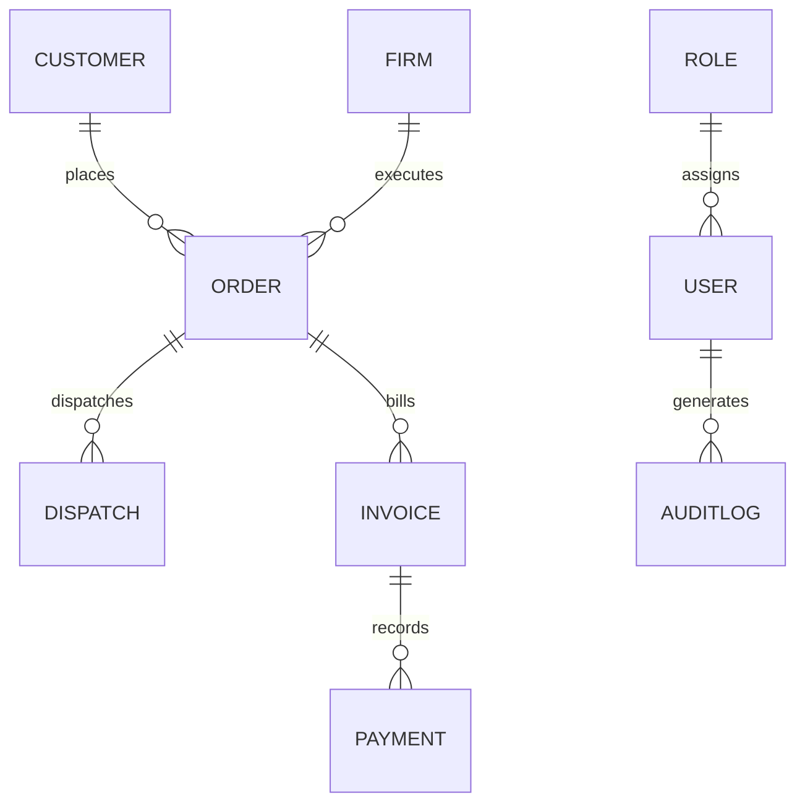

# Database Schema & Model Dictionary

This document details the MongoDB schemas configured through Mongoose models in the backend database.

---

## 1. User & Role Collections

### 1.1. Role Collection (`roles`)
Defines predefined permission levels in the system.
- `name` (String, Required, Unique): Role identifier (e.g. `'MD'`, `'admin'`, `'sales'`, `'logistics'`).
- `permissions` (Array of ObjectId): References to permission rules.
- `isActive` (Boolean, Default: `true`): Availability flag.

### 1.2. User Collection (`users`)
Stores profile and access credentials.
- `firstName` (String, Required)
- `lastName` (String, Required)
- `email` (String, Required, Unique): Login ID.
- `passwordHash` (String, Required): Hashed using Bcrypt.
- `roleId` (ObjectId, Ref: `'Role'`): References the user's role.
- `userType` (String): Normalized enum for fallback checks.
- `status` (String, Default: `'ACTIVE'`): `ACTIVE`, `INACTIVE`.

---

## 2. Leads & Customers

### 2.1. Lead Collection (`leads`)
- `companyName` (String, Required)
- `contactPerson` (String, Required)
- `mobile` (String, Required)
- `email` (String)
- `status` (String, Default: `'NEW'`): `NEW`, `CONTACTED`, `QUALIFIED`, `LOST`, `CONVERTED`.
- `assignedExecutiveId` (ObjectId, Ref: `'User'`)
- `notes` (Array of Object): History of follow-up updates.

### 2.2. Customer Collection (`customers`)
- `companyName` (String, Required)
- `customerCode` (String, Unique): Unique business ID.
- `contactPerson` (String, Required)
- `mobile` (String, Required)
- `email` (String)
- `creditLimit` (Number, Default: `0`)
- `executionFirms` (Array of ObjectId, Ref: `'Firm'`): Enabled billing firms.

---

## 3. Order & Dispatches

### 3.1. Order Collection (`orders`)
- `orderNumber` (String, Unique): Format `ORD-XXXXX`.
- `customerId` (ObjectId, Ref: `'Customer'`, Required)
- `executionFirmId` (ObjectId, Ref: `'Firm'`, Required)
- `orderDate` (Date, Default: `Date.now`)
- `products` (Array of Subschema):
  - `productName` (String, Required)
  - `quantity` (Number, Required)
  - `unit` (String, Default: `'tons'`)
  - `supplyRate` (Number): Base purchase cost from supplier.
  - `freight` (Number): Per-unit estimated freight.
  - `margin` (Number): Per-unit profit margin.
  - `gstPercent` (Number): GST percentage.
  - `gstAmount` (Number): Dynamic row GST calculation.
  - `rate` (Number): Selling rate including GST.
  - `total` (Number): Quantity * Rate.
- `estimatedFreight` (Number): Total planned freight budget.
- `advanceAmount` (Number, Default: `0`)
- `totalOrderValue` (Number): Sum of all product row totals.
- `balanceAmount` (Number): Total Billing - Advance.
- `status` (String, Default: `'DRAFT'`):
  - Enums: `DRAFT`, `PENDING_MD_APPROVAL`, `APPROVED`, `REJECTED`, `LOGISTICS_PENDING`, `FREIGHT_APPROVAL_PENDING`, `DISPATCH_READY`, `SHIPPED`, `DELIVERED`, `CANCELLED`.
- `statusHistory` (Array of Subschema):
  - `status` (String)
  - `updatedBy` (ObjectId, Ref: `'User'`)
  - `updatedByName` (String)
  - `remarks` (String)
  - `updatedAt` (Date)
- `materialAdjustment` (Object):
  - `adjustedToOrderId` (ObjectId, Ref: `'Order'`)
  - `adjustmentType` (String): `DIVERTED_TO_OTHER_ORDER`, `RETURNED_TO_STOCK`, `OTHER`
  - `adjustmentRemarks` (String)
  - `adjustedAt` (Date)
  - `adjustedBy` (ObjectId, Ref: `'User'`)

### 3.2. Dispatch Collection (`dispatches`)
Tracks individual vehicle trips.
- `dispatchNumber` (String, Unique): Format `DSP-XXXXX`.
- `orderId` (ObjectId, Ref: `'Order'`, Required)
- `firmId` (ObjectId, Ref: `'Firm'`)
- `customerId` (ObjectId, Ref: `'Customer'`)
- `transporterName` (String)
- `vehicleNumber` (String, Required)
- `driverName` (String, Required)
- `driverMobile` (String, Required)
- `lrNumber` (String): Lorry receipt.
- `freightCost` (Number, Default: `0`): Actual trip cost.
- `loadingCharges` (Number, Default: `0`)
- `isFreightApproved` (Boolean, Default: `false`)
- `transporterPaymentStatus` (String): `PENDING`, `PAID`
- `transporterPaymentProofUrl` (String)
- `transporterPaymentDate` (Date)
- `transporterPaymentRemarks` (String)
- `products` (Array of Subschema):
  - `productName` (String)
  - `quantity` (Number): Tonnage loaded in this vehicle.
- `dispatchDate` (Date, Default: `Date.now`)
- `expectedDeliveryDate` (Date)
- `status` (String, Default: `'PLANNED'`):
  - Enums: `PLANNED`, `FREIGHT_APPROVAL_PENDING`, `DISPATCHED`, `IN_TRANSIT`, `DELIVERED`.

---

## 4. Finance Ledger

### 4.1. Invoice Collection (`invoices`)
- `invoiceNumber` (String, Unique): Format `INV-XXXXX`.
- `orderId` (ObjectId, Ref: `'Order'`, Required)
- `invoiceAmount` (Number, Required)
- `invoiceDate` (Date, Default: `Date.now`)
- `status` (String, Default: `'PENDING'`): `PENDING`, `PARTIALLY_PAID`, `PAID`, `CANCELLED`.

### 4.2. Payment Collection (`payments`)
- `paymentNumber` (String, Unique): Format `PAY-XXXXX`.
- `invoiceId` (ObjectId, Ref: `'Invoice'`, Required)
- `amountReceived` (Number, Required)
- `paymentDate` (Date, Required)
- `paymentMode` (String, Default: `'BANK_TRANSFER'`): `CASH`, `CHEQUE`, `BANK_TRANSFER`, `UPI`.
- `referenceNumber` (String)
- `remarks` (String)
