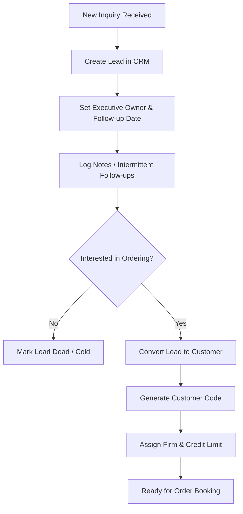
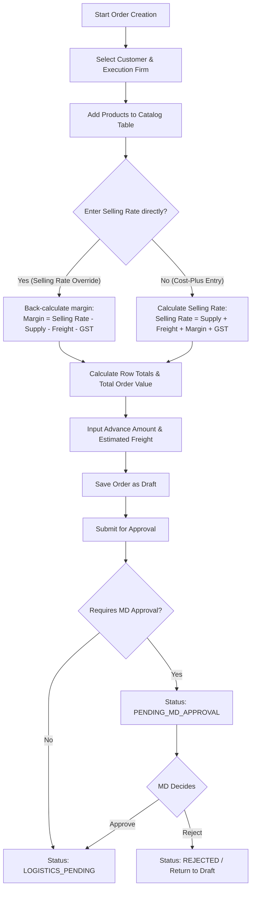
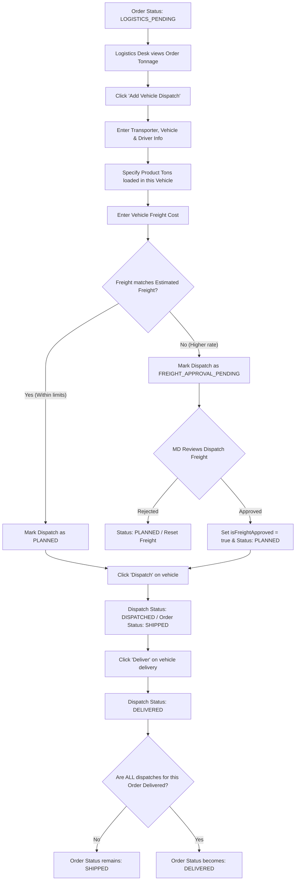
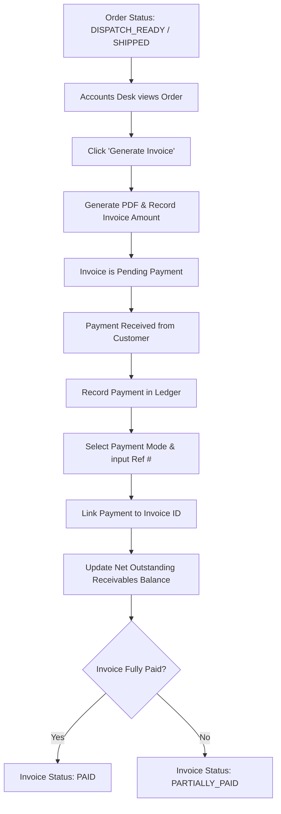

# User Flow & Process Diagrams

This document illustrates the step-by-step user journeys and status transitions for core system actions.

---

## 1. Lead Tracking to Customer Conversion Flow

This flow maps how a Salesperson captures customer inquiries and transitions them into permanent billing records.

---

## 2. Order Pricing, Calculations & Approval Flow

This flow covers order creation, bidirectional pricing auto-calculations, and MD approval guards for rate overrides or low-margin transactions.

---

## 3. Multi-Vehicle Logistics & Dispatch Flow

This flow covers physical logistics: planning vehicle dispatches, requesting approvals for freight cost exceptions, shipping, and delivery sync.

---

## 4. Invoice & Billing Ledger Flow

This flow describes how invoices are auto-generated from orders and how payments are applied against them.

